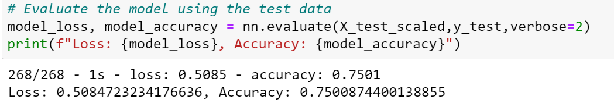

# Neural_Network_Charity_Analysis

## Overview of the analysis
Alphabet Soup is a philantropic foundation that raises and donates money to help other organizations that protect the environment, unify the world and improved people's well being. The challenge is to analyze the imapact of each donation and vet potential recipients to ensure that the donation is being used effectively. 

In this challenge, we will be evaluating  34,000 comapanies that have been funded by Alphabet Soup to predict where to make investments in future. We will use machine learning and neural networks to create a binary classifier capable of predicting applicants that have the potential to succeed when funded by Alphabet Soup.

 

## Resources
- **Code files:** 
    - AlphabetSoupCharity.ipynb
    - AlphabetSoupCharity_Optimzation_Attempt1.ipynb
    - AlphabetSoupCharity_Optimzation_Attempt2.ipynb
    - AlphabetSoupCharity_Optimzation_Attempt3.ipynb
- **HDF5 files:**
    - AlphabetSoupCharity.h5
    - AlphabetSoupCharity_Optimization_1.h5
    - AlphabetSoupCharity_Optimization_2.h5
    - AlphabetSoupCharity_Optimization_3.h5
- **Data file:** Resources/charity_data.csv

 

## Results

**Data Preprocessing**:
- Target Variable 
    - IS_SUCCESSFUL
- Features 
    - APPLICATION_TYPE
    - AFFILIATION
    - CLASSIFICATION
    - USE_CASE
    - ORGANIZATION
    - STATUS
    - INCOME_AMT
    - SPECIAL_CONSIDERATIONS
    - ASK_AMT
    - NAME (Added this while optimizing the model caused a slight increase in accuracy)
- Neither targets nor features
    - EIN

**Compiling, Training, and Evaluating the Model**
- The optimized model consists of the following:
    - Three hidden layers: 
        - adding the third hidden layer increased the accurancy slightly. 
        - Adding a fourth layer resulted in much longer training time with no accuracy gain.
    - Relu activation function was used for first and second hidden layers and sigmoid for third hidden layer and output layer. This combination was able to train the model with 75% accuracy.
    - Neurons:
        - 20 in first hidden layer
        - 10 in second hidden layer
        - 8 in third hidden layer

- Successful in achieving target model performance on third attempt (75.01%)

  

     

- Steps taken for optimization
     - added/updated bins
     - added more hidden layers
     - added more neurons per layer
     - tried different activation functions
     - increased epochs 

 

## Summary

Overall, the model can benefit from additional information about the companies such as adminstrative expenses, success ratio in their initiatives (# of projects taken on vs # of projects succesfully completed by organization etc). 

Neural network is probably a better choice given that the dataset, although not complicated, has a lot datapoints. Random forest with 128 estimators and svm produces 73.2% accuracy
